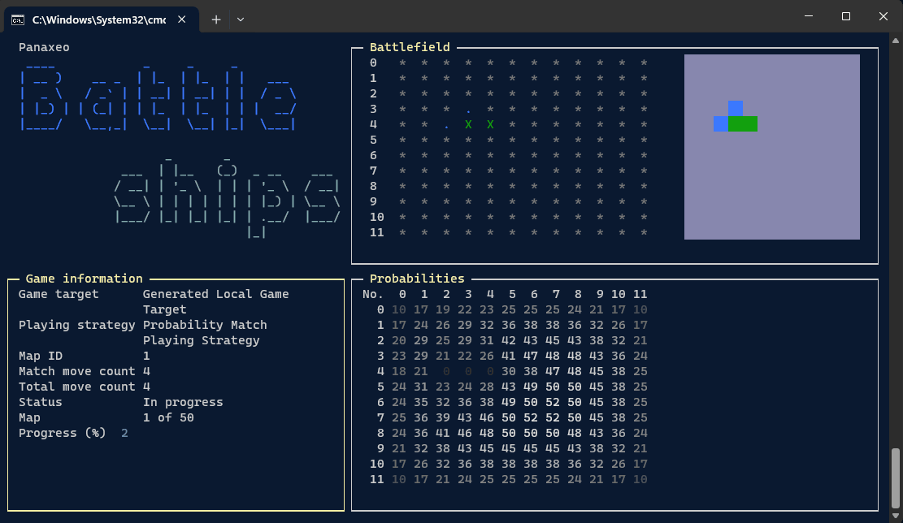

# Panaxeo Coding Arena 2023 - Battleship playground

# Description
This project aims to provide a playground for the [Panaxeo Coding Arena](https://www.panaxeo.com/coding-arena) competition.

The project is written in C# and .NET Core 8.0. It is a console application that can be run on Windows, Linux, and macOS. Acctualy there are two projects. One with the UI and one without. The one without the UI is faster. The UI is just for fun, and nice visualisation. It is not optimized for performance, od code quality.



## Competition
The description of the competition can be found in [GAME_ASSIGNMENT.md](GAME_ASSIGNMENT.md) or at [Panaxeo Coding Arena](https://www.panaxeo.com/coding-arena) website.

**🛑 DISCLAIMER: It you run the `battleships.app` project, the one with the UI. Keep in mind that the UI and to game processing run in the same thread. So rendering the UI is slowing the processing/playing the game. If you want faster execution feel free to use the `battleships.app.simple` project. There is nothing more than just a POCO (Plain old console :-)).**

## How to run

As mentioned before there are 2 console projects in the solution. 
- `battleships.app` - with UI
- `battleships.app.simple` - without UI

### Prerequisites
To run these projects you need to have .NET Core 8.0 installed on your machine. You can download it from [here](https://dotnet.microsoft.com/download/dotnet-core/8.0).

### Run with UI
After you have .NET Core 8.0 installed you can run the project with the following command:

```bash
dotnet run --project battleships.app
```

### Run without UI
```bash
dotnet run --project battleships.app.simple
``` 
if the speed of the game will be too fast for you, you can slow it down adjusting the `Thread.Sleep` in the `Program.cs` file in `RenderMatchData` method.

## Description of the solution

The are 3 main objects in the solution:

### Game targets - `IGameTarget` 
Represents the target you are shooting at.

There are 3 game targets implemented:
- `ConcreteLocalGameTarget` - this is the target that is initialized with one predefine map.
- `GeneratedLocalGameTarget` - a local game target which generates random maps with ships. The maps are generated with the `ShipPlacementGenerator` class. 
- `PanaxeoApiGameTarget` - this game target is using the Panaxeo API. If you want to use it you need obtain a `token`. You can find more information about the API [here](https://www.panaxeo.com/coding-arena).

 Sample initialization of the `ConcreteLocalGameTarget`:
 ```csharp
 var gameTarget = new ConcreteLocalGameTarget(new ConcreteGameTargetOptions
{
     Rows = 12,
     Columns = 12,
     MapStateGrid = new[]
     {
         0, 0, 0, 0, 0, 0, 0, 0, 0, 0, 0, 0,
         0, 0, 0, 0, 0, 0, 0, 0, 0, 0, 2, 0,
         0, 0, 0, 0, 9, 0, 0, 0, 0, 0, 2, 0,
         0, 0, 0, 9, 9, 9, 0, 0, 0, 0, 0, 0,
         0, 0, 0, 0, 9, 0, 0, 0, 0, 0, 0, 3,
         0, 0, 0, 9, 9, 9, 0, 0, 4, 0, 0, 3,
         0, 0, 0, 0, 9, 0, 0, 0, 4, 0, 0, 3,
         0, 0, 0, 0, 0, 0, 0, 0, 4, 0, 0, 0,
         0, 0, 0, 0, 0, 0, 0, 0, 0, 0, 0, 0,
         6, 6, 6, 6, 6, 0, 0, 0, 0, 0, 0, 0,
         0, 0, 0, 0, 0, 0, 0, 0, 5, 5, 5, 5,
         0, 0, 0, 0, 0, 0, 0, 0, 0, 0, 0, 0
     }
 }, loggerFactory);
 ```
Each ship is defined with a number. Each type of ship has it's own number. `AvengersHelicarrier = 9, Carrier = 6, Battleship = 5, Destroyer = 4, Submarine = 3, Boat = 2` It is just a small help for `LocalGameTargets`.

### Match playing strategies - `IMatchPlayingStrategy`
- represents the strategy of playing the game. It is responsible for generating the next shot. As input it receives the current state of the game. AnIt returns the next shot. 

There are 3 strategies implemented:
- `DummyMatchPlayingStrategy` - in this strategy, we just go through the grid from left to right, top to bottom.

- `SimpleMatchPlayingStrategy` - In this strategy we are using a simple approach to find the next target cell. We have two modes: *Searching* and *Targeting*. In searching mode we are not scanning cells one by one, but *randomly picking one of the untouched cells using parity fields (like on the chess board)*. If we hit a ship, we are switching to targeting mode. In targeting mode we are using the last hit cell as a starting point and try to find the next cell by checking the surrounding cells. If we hit a ship, we are adding the surrounding cells to a queue and try to hit them one by one.

- `ProbabilityMatchPlayingStrategy` - In this strategy we are using a probability grid to find the next target cell. We have two modes: *Searching* and *Targeting*. After each shot we are updating the *probability grid*. In searching mode we pick the cell with the highest probability. In targeting mode we are using the last hit cell as a starting point and try to find the next cell by checking the surrounding cells. If we hit a ship, we are adding the surrounding cells to a queue and try to hit them one by one.

> The implemented strategies have just one flaw. They *use* avenger immediately right after the avenger hellicarrier was destroyed. I did not understand the rules correctly.

Feel free to implement your own strategy. You just need to implement the `IMatchPlayingStrategy` interface.

Those implemented ones are are not optimal. The targetting mode can be improved for sure. 

To implement your own strategy you need to implement the `IMatchPlayingStrategy` interface with one method `GetNextTarget`. The method receives the current state of the game and returns the next shot. 

```csharp
  /// <summary>
  /// Gets the next target to shoot at.
  /// </summary>
  /// <param name="matchState">The current state of the match.</param>
  /// <returns>The next target to shoot at.</returns>
  MatchNextTargetCell GetNextTarget(MatchState matchState);
```
### Game - `Game`
Represents the game. It is responsible for playing the game based on configuration. (Size of the grid, game target, match playing strategy, num of matches, etc.)

### Match - `Match`
Represents a single match. It is responsible for playing a single match. It is using the `MatchPlayingStrategy` to generate the next shot. It is also responsible for updating the game state based on the shot result.

## Sample configuration

`GeneratedLocalGameTarget` and `ProbabilityMatchPlayingStrategy`
```csharp
using var loggerFactory = LoggerFactory.Create(builder => builder.AddSerilog(serilog));

// create the ship placement generator
var shipPlacementGenerator = new ShipPlacementGenerator();

// create the game target
var gameTarget = new GeneratedLocalGameTarget(
    new GeneratedLocalGameTargetOptions
    {
        Rows = Constants.GridRows,
        Columns = Constants.GridColumns,
        MapCount = 200,
    },
    shipPlacementGenerator,
    loggerFactory
);

// create the match playing strategy using a factory
var matchPlayingStrategyCreator = new MatchPlayingStrategyFactory(loggerFactory, (lf) => new ProbabilityMatchPlayingStrategy(lf));

var game = new Game(
    gameTarget,
    matchPlayingStrategyCreator,
    loggerFactory,
    isSimulation: true // simulation mode enabled
);

// start playing the game
var gameResults = await game.PlayAsync();

Console.WriteLine($"Total number of moves: {gameResults.TotalMoveCount}");

```

`PanaxeoApiGameTarget` and `ProbabilityMatchPlayingStrategy`
```csharp
using var loggerFactory = LoggerFactory.Create(builder => builder.AddSerilog(serilog));

string authorizationToken = "PANAXEO_CODING_ARENA_2023_AUTH_TOKEN";

// configure the http client
var httpClient = new HttpClient();
httpClient.BaseAddress = new Uri("https://europe-west1-ca-2023-dev.cloudfunctions.net/battleshipsApi");
httpClient.DefaultRequestHeaders.Authorization = new System.Net.Http.Headers.AuthenticationHeaderValue("Bearer", authorizationToken);

// create the game target
var gameTarget = new PanaxeoApiGameTarget(httpClient, loggerFactory);

// create the match playing strategy using a factory
var matchPlayingStrategyCreator = new MatchPlayingStrategyFactory(loggerFactory, (lf) => new ProbabilityMatchPlayingStrategy(lf));

// create the game
var game = new Game(
    gameTarget,
    matchPlayingStrategyCreator,
    loggerFactory,
    isSimulation: true // simulation mode enabled
);

// start playing the game
var gameResults = await game.PlayAsync();

Console.WriteLine($"Total number of moves: {gameResults.TotalMoveCount}");

```

To find more examples check the `Program.cs` files in the `battleships.app` and `battleships.app.simple` projects.

## NuGet packages used
- [Spectre.Console](    https://www.nuget.org/packages/Spectre.Console/) - for the UI
- [Serilog](https://www.nuget.org/packages/Serilog/) - for logging